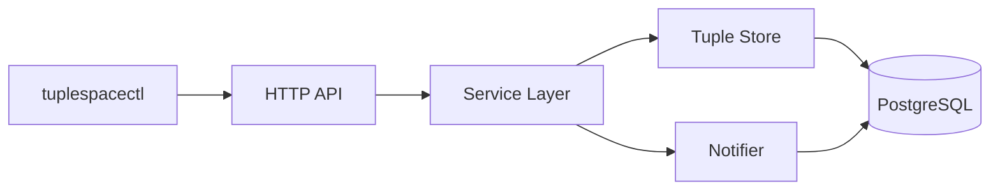

# TupleSpace

TupleSpace is a small Linda-style coordination system implemented in Go. The repository contains:

- `tuplespaced`, an HTTP server backed by PostgreSQL
- `tuplespacectl`, a Glazed-powered CLI for tuple operations and admin workflows
- a compact tuple/template DSL for shell-friendly usage
- Docker Compose for local Postgres and server startup
- embedded Glazed help pages for both binaries

The system is intentionally conservative. PostgreSQL is the source of truth, matching semantics stay in Go where they are easy to reason about, and `LISTEN/NOTIFY` is used as a wake-up mechanism rather than as the correctness boundary.

## Why TupleSpace

TupleSpace is a coordination primitive rather than a queue with fixed routing rules. Producers write tuples into a shared space. Consumers read or consume tuples by matching a template. That keeps producers decoupled from consumers and avoids hard-wiring a topic graph into the application.

This implementation focuses on simple, explainable correctness:

- `out` writes a tuple into a named space
- `rd` reads a matching tuple without consuming it
- `in` reads and consumes a matching tuple exactly once

## Quick Start

Start the local stack:

```bash
docker compose up -d postgres tuplespaced
docker compose ps
curl -sS http://127.0.0.1:18081/healthz
```

Set default CLI environment variables:

```bash
export TUPLESPACECTL_SERVER_URL=http://127.0.0.1:18081
export TUPLESPACECTL_SPACE=jobs
```

Run a first roundtrip:

```bash
go run ./cmd/tuplespacectl admin health --output json
go run ./cmd/tuplespacectl tuple out 'job,42,true' --output json
go run ./cmd/tuplespacectl tuple rd 'job,?id:int,?ready:bool' --output json
go run ./cmd/tuplespacectl tuple in 'job,?id:int,?ready:bool' --output json
go run ./cmd/tuplespacectl admin dump --space jobs --output json
```

## CLI Usage

The tuple DSL is the fastest way to learn the client:

```bash
go run ./cmd/tuplespacectl tuple out --space jobs 'job,42,true'
go run ./cmd/tuplespacectl tuple rd --space jobs 'job,?id:int,?ready:bool'
go run ./cmd/tuplespacectl tuple in --space jobs 'job,?id:int,?ready:bool'
```

You can also use JSON files:

```bash
go run ./cmd/tuplespacectl tuple out --space jobs --tuple-file ./tuple.json
go run ./cmd/tuplespacectl tuple rd --space jobs --template-json-file ./template.json
```

The admin command group exposes inspection and maintenance operations:

```bash
go run ./cmd/tuplespacectl admin spaces --output json
go run ./cmd/tuplespacectl admin stats --output json
go run ./cmd/tuplespacectl admin dump --space jobs --output json
go run ./cmd/tuplespacectl admin waiters --output json
go run ./cmd/tuplespacectl admin tuple get --tuple-id 1 --output json
```

## Help Pages

Both binaries expose embedded Glazed help pages. Use these when you want the operator-facing documentation from inside the CLI:

```bash
go run ./cmd/tuplespacectl help --topics
go run ./cmd/tuplespacectl help tuple-dsl
go run ./cmd/tuplespacectl help tutorial-first-roundtrip
go run ./cmd/tuplespaced help --topics
go run ./cmd/tuplespaced help tuplespaced-local-dev
```

Note that in this Glazed checkout the discovery flag is `help --topics`, not `help topics`.

## Architecture

The system is split into a narrow HTTP API, a service layer, a Postgres-backed store, and a notifier:



The critical correctness rule is simple:

- PostgreSQL owns canonical state
- the service owns operation flow
- the notifier only wakes blocked readers and takers

That means a delayed or missed notification can hurt responsiveness, but it does not redefine correctness.

## Blocking Reads

Blocking `rd` and `in` requests accept `--wait-ms`. The CLI now derives its HTTP timeout from that wait value with additional buffer time, so long waits do not fail at a fixed client-side 15 second ceiling.

Example:

```bash
go run ./cmd/tuplespacectl tuple in --space jobs 'job,?id:int,?ready:bool' --wait-ms 60000 --output json
```

## Repository Docs

Use these documents depending on what you need:

- [docs/project-report.md](docs/project-report.md): detailed architecture, testing history, debugging notes, and next steps
- `go run ./cmd/tuplespacectl help --topics`: operator-facing CLI docs
- `go run ./cmd/tuplespaced help --topics`: server startup and local development help

## Testing

Common validation commands:

```bash
go test ./internal/client -count=1
go test ./... -count=1
go build ./cmd/tuplespacectl ./cmd/tuplespaced
```

The broader suite includes real Postgres-backed tests because the project’s main risks are transactional and concurrency-related rather than purely structural.

## Troubleshooting

| Problem | Cause | Solution |
|---|---|---|
| `connection refused` | `tuplespaced` is not running or the wrong URL is configured | Check `docker compose ps`, `--server-url`, or `TUPLESPACECTL_SERVER_URL` |
| `not_found` from `rd` or `in` | No tuple matches the template | Confirm the space name, arity, and field types |
| `404 page not found` from admin commands | The server process is older than the CLI expectations | Rebuild and restart the active server |
| `context deadline exceeded` on blocking tuple commands | The request timeout is shorter than the intended wait, or an old binary is running | Rebuild the CLI and retry with the current code |
| migration startup failure | The server was launched from a directory where `migrations/` is not available | Run from the repo root or make migration lookup configurable |

## See Also

- [cmd/tuplespacectl/doc/tuplespacectl-overview.md](cmd/tuplespacectl/doc/tuplespacectl-overview.md)
- [cmd/tuplespacectl/doc/tuple-dsl.md](cmd/tuplespacectl/doc/tuple-dsl.md)
- [cmd/tuplespaced/doc/tuplespaced-overview.md](cmd/tuplespaced/doc/tuplespaced-overview.md)
- [docs/project-report.md](docs/project-report.md)
