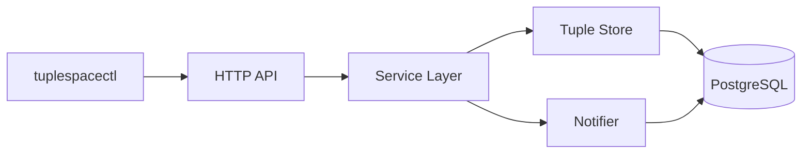
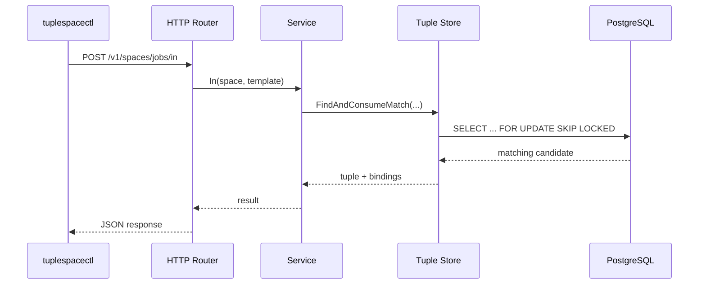

# TupleSpace Project Report

This document is the repo-native version of the project report. It exists so the architecture, operator workflows, debugging history, and follow-up questions live alongside the code rather than only in an external notes system.

## What This System Is

TupleSpace is a small Linda-style coordination service implemented in Go. It provides a shared space where clients can write tuples and other clients can read or consume them by matching templates. The repository contains two executables:

- `tuplespaced`, the HTTP server
- `tuplespacectl`, the Glazed-powered CLI

The design is intentionally simple and conservative. PostgreSQL is the source of truth, matching semantics stay in Go, and Postgres notifications are used only to wake blocked readers and takers.

## Why This Project Exists

The point of the project is to provide a coordination primitive rather than a queue with a fixed routing model. Producers do not need to know which consumer will handle a tuple. Consumers do not need to subscribe to a rigid topic graph. That makes the system flexible for experiments, job handoff, and loosely coupled workflows.

The implementation deliberately avoids spreading semantics across too many layers. This makes the system much easier to explain, debug, and extend.

## Current Status

The system is implemented and operational:

- `tuplespaced` starts an HTTP server and applies migrations
- tuple writes, reads, and destructive takes work
- blocking semantics are supported through a notifier loop
- the CLI supports JSON file input and a compact tuple/template DSL
- the admin command set supports inspection and maintenance workflows
- Docker Compose runs local Postgres and the server together
- both binaries expose embedded Glazed help pages
- blocking tuple requests now scale their client timeout from `--wait-ms`

## System Shape

The codebase is organized around a narrow runtime flow:

- `cmd/tuplespaced/main.go`: startup, config, migrations, dependency wiring
- `cmd/tuplespacectl/main.go`: CLI root, logging, help, command groups
- `internal/api/httpapi`: request translation and HTTP handlers
- `internal/service`: operation-level logic for `out`, `rd`, and `in`
- `internal/store`: persistence and concurrency-sensitive tuple operations
- `internal/notify`: Postgres `LISTEN/NOTIFY` wake-up integration
- `internal/client`: HTTP client used by the CLI
- `internal/types`, `internal/match`, `internal/validation`: tuple model and matcher support

## High-Level Architecture



The critical design choice is that PostgreSQL owns correctness. Notifications improve responsiveness, but they do not define truth. If a notification is delayed or missed, the blocked operation still re-queries the store instead of trusting the wake-up path as the only source of state.

## Core Semantics

The Linda-style operations are:

- `out`: write a tuple into a named space
- `rd`: read a matching tuple without removing it
- `in`: read and remove a matching tuple exactly once

The current type system is intentionally small:

- `string`
- `int`
- `bool`

That keeps the matcher and persistence logic predictable while leaving space for future expansion if richer value kinds are needed.

## Data Model

The schema stores tuples as a tuple row plus ordered field rows. Conceptually:

```text
tuples
  id
  space
  created_at

tuple_fields
  tuple_id
  position
  value_type
  string_value
  int_value
  bool_value
```

This shape preserves field ordering, keeps types explicit, and makes it practical to load candidate tuples for semantic matching in Go.

## Request Flow

The runtime flow is easiest to understand from the outside in:

1. a client sends `out`, `rd`, or `in` over HTTP
2. the HTTP layer validates and normalizes the request
3. the service layer tries the operation immediately
4. the store reads canonical state from PostgreSQL
5. for blocking operations, the notifier wakes the service and the service retries

Representative destructive-read flow:



The concurrency-sensitive detail is `FOR UPDATE SKIP LOCKED` during destructive consume. That lets one consumer take a tuple while other concurrent consumers skip locked rows instead of blocking behind them.

## CLI and Operator Surface

The CLI exposes tuple and admin command groups.

Tuple commands:

- `tuplespacectl tuple out`
- `tuplespacectl tuple rd`
- `tuplespacectl tuple in`

Admin commands:

- `tuplespacectl admin health`
- `tuplespacectl admin spaces`
- `tuplespacectl admin dump`
- `tuplespacectl admin peek`
- `tuplespacectl admin export`
- `tuplespacectl admin stats`
- `tuplespacectl admin config`
- `tuplespacectl admin schema`
- `tuplespacectl admin waiters`
- `tuplespacectl admin notify-test`
- `tuplespacectl admin purge`
- `tuplespacectl admin tuple get`
- `tuplespacectl admin tuple delete`

The CLI also includes embedded Glazed help pages and shared logging flags. The root initialization now follows the same pattern as `glaze` itself, so help pages appear through `help --topics` and `help <slug>`.

## CLI Input Model

The CLI supports two input styles:

- JSON files for repeatable fixtures and programmatic generation
- a compact tuple/template DSL for fast shell usage

Examples:

```bash
tuplespacectl tuple out --space jobs 'job,42,true'
tuplespacectl tuple rd --space jobs 'job,?id:int,?ready:bool'
tuplespacectl tuple in --space jobs 'job,?id:int,?ready:bool'
```

Environment defaults are also supported:

```bash
export TUPLESPACECTL_SERVER_URL=http://127.0.0.1:18081
export TUPLESPACECTL_SPACE=jobs
```

## Local Development Workflow

The current local loop is Docker Compose based:

```bash
docker compose up -d postgres tuplespaced
docker compose ps
curl -sS http://127.0.0.1:18081/healthz
```

Then use the CLI:

```bash
go run ./cmd/tuplespacectl admin health --output json
go run ./cmd/tuplespacectl tuple out 'job,42,true' --output json
go run ./cmd/tuplespacectl admin dump --space jobs --output json
```

## Testing and Validation

This project was validated through both automated tests and real manual runs.

Automated validation included:

- `go test ./internal/store -count=1`
- `go test ./internal/notify ./internal/service ./internal/api/httpapi -count=1`
- `go test ./cmd/tuplespacectl/... ./internal/client -count=1`
- `go test ./internal/client -count=1`
- `go build ./cmd/tuplespacectl ./cmd/tuplespaced`

The important thing about the test strategy is that the store and service behavior were exercised against real PostgreSQL-backed paths rather than only mocks.

Manual validation included:

1. start PostgreSQL in Docker
2. start `tuplespaced`
3. run `tuplespacectl admin health`
4. run `tuplespacectl tuple out`
5. run `tuplespacectl tuple in`
6. run `tuplespacectl tuple rd`

That proved the destructive consume semantics in a live system.

There was also a later regression test for long blocking waits. The original failure mode was that the HTTP client timeout was fixed at 15 seconds even when `--wait-ms` requested a much longer wait. That has been corrected so blocking reads derive their request timeout from `wait-ms` with additional buffer time.

## Debugging History

These issues are worth preserving because they explain real integration boundaries:

- testcontainers helper drift required switching to `tcpostgres.BasicWaitStrategies()`
- an early smoke test hard-coded a port that was already in use
- `go run` based smoke paths left orphaned child processes
- running the built server from the wrong working directory broke migration discovery
- a Glazed flag collision forced `template-file` to become `template-json-file`
- a stale running server image returned plain `404 page not found` for newer admin routes
- the first Glazed help assumption used `help topics` instead of the correct `help --topics`
- blocking tuple commands originally timed out at the client before the server-side wait elapsed

Those were normal integration problems, but they also clarified where the real operational edges are.

## Remaining Questions

- Should migrations be embedded into the server binary or loaded from a configurable path?
- Should the type system remain intentionally small or expand to richer value kinds?
- Should long blocking semantics stay request-scoped over HTTP or move to streaming or RPC later?
- Should the admin surface remain HTTP/JSON only or grow richer diagnostics?
- Does the first production use case need authentication and multi-tenant ownership?

The most immediate operational issue remains migration discovery when the compiled server is launched outside the repo root.

## Recommended Reading Order

For a new engineer, the best reading order is:

1. `cmd/tuplespaced/main.go`
2. `internal/api/httpapi/router.go`
3. `internal/service/service.go`
4. `internal/store/tuple_store.go`
5. `internal/notify/notifier.go`
6. `migrations/001_init_tuplespace.sql`
7. `cmd/tuplespacectl/main.go`

That follows the real runtime control flow and makes the codebase much easier to understand.

## See Also

- [../README.md](../README.md)
- [../cmd/tuplespacectl/doc/tuplespacectl-overview.md](../cmd/tuplespacectl/doc/tuplespacectl-overview.md)
- [../cmd/tuplespacectl/doc/tuple-dsl.md](../cmd/tuplespacectl/doc/tuple-dsl.md)
- [../cmd/tuplespaced/doc/tuplespaced-overview.md](../cmd/tuplespaced/doc/tuplespaced-overview.md)
